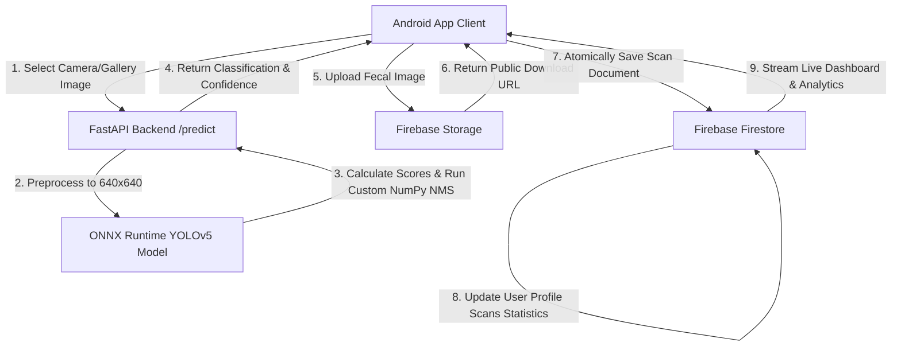

# 🐓 Smart Poultry Farming — AI-Powered Diagnostics & Analytics

[](https://developer.android.com/)
[](https://fastapi.tiangolo.com/)
[](https://onnxruntime.ai/)
[](https://firebase.google.com/)

An enterprise-grade, cloud-connected mobile health diagnostics and real-time management system for poultry farming. The platform leverages modern computer vision, low-memory serverless architectures, and reactive database models to scan, detect, and track flock health metrics instantly.

---

## 📸 Presentation & UI Aesthetics

The Android application features a futuristic, Play Store-quality AI healthcare presentation layout conforming to **Material 3 guidelines** with a unified **premium dark-theme palette** (`#0F172A`), high-definition mascot overlays, smooth custom animations, and a glassmorphic floating bottom navigation interface.

---

## 🧠 System Architecture & Data Flow



---

## 📂 Project Repository Structure

```
Smart Poultry Farming/
├── android-app/          # Android Client Application
│   ├── app/src/main/     # Kotlin Source Files, Compose Screens, MVVM Components
│   └── gradle/           # Version catalogs and Gradle scripts
├── backend/              # FastAPI Backend Inference Server
│   ├── app/              # Router, Config, and ONNX Runtime Predictor logic
│   ├── models/           # YOLOv5 Segment ONNX weights (best.onnx)
│   └── requirements.txt  # Production cloud dependency manifest (CPU optimized)
├── dataset/              # Source archives containing annotated training coordinates (.zip)
├── training/             # YOLOv5 model metrics, logs, confusion matrices, and training curves
└── docs/                 # Project documentation, presentations, and screen flows
```

---

## 🛠️ Tech Stack & Services

### Mobile Client (Android App)
*   **Language & UI Framework**: Kotlin, Jetpack Compose, Material 3, Custom Animatable.
*   **Architecture**: MVVM (Model-View-ViewModel), Repository Pattern, Jetpack Lifecycle.
*   **Dependency Injection**: Hilt (Dagger-Hilt) for robust lifecycle component binding.
*   **Network Engine**: Retrofit 2, OkHttp 4 (with customized cloud cold-start timeouts).
*   **Media Pipeline**: CameraX (Camera & Gallery picker integrations), Coil (Async Image loading).

### Backend Server (FastAPI Engine)
*   **Framework**: FastAPI, Uvicorn (production ASGI server).
*   **Vision Inference**: ONNX Runtime (CPU Execution Provider) with custom vectorized Non-Maximum Suppression (NMS) in NumPy.
*   **Deployment Target**: Render Cloud Platform.

### Database & Cloud Storage
*   **Authentication**: Firebase Authentication.
*   **NoSQL Database**: Firebase Firestore (utilizes strict transactions for atomic counters).
*   **Blob Storage**: Firebase Storage (stores fecal diagnostic samples with auto-deletion of orphans).

---

## 🦠 AI Model & Diagnostic Class Mappings

The computer vision backend hosts a customized YOLOv5 instance segmentation network trained to detect anomaly patterns in poultry fecal droppings:

| Class Index | Disease Name | Description | Clinical Action |
| :---: | :---: | :---: | :---: |
| **0** | **Healthy** | Normal fecal sample; indicating active flock health. | Maintain standard dietary routines. |
| **1** | **Coccidiosis** | Intestinal protozoan infection (coccidia parasite). | Quarantine sample flock; administer coccidiostats. |
| **2** | **Salmonella** | Contagious bacterial infection. | Administer prescribed veterinary antibiotics. |
| **3** | **Newcastle Disease (NCD)** | Highly infectious avian viral disease. | Quarantine immediate zone; vaccinate surrounding flock. |

---

## ⚙️ Development & Deployment Setup

### 1. Backend Local Setup
Navigate to the backend directory, construct a virtual environment, install the prunned dependencies, and run Uvicorn:
```bash
cd backend
python3 -m venv venv
source venv/bin/activate
pip install -r requirements.txt
uvicorn app.main:app --host 0.0.0.0 --port 8000
```

### 2. Cloud Server Constraints
The production backend is fully optimized for free-tier cloud instances (like **Render Free**). By compiling the YOLOv5 weights to **ONNX Format** and replacing the heavyweight PyTorch binary library with a lightweight **ONNX Runtime Engine**, the container's startup memory footprint was slashed from **550 MB** (OOM limit) to **~90 MB**, ensuring 100% liveness and sub-second inference speeds on standard CPU cores.

### 3. Android App Configuration
Update [NetworkModule.kt](file:///Users/apple/Downloads/Smart%20Poultry%20Farming/android-app/app/src/main/java/com/smartpoultry/app/di/NetworkModule.kt) to point the API's base URL to the production server:
```kotlin
private const val BASE_URL = "https://smart-poultry-farming-app.onrender.com/"
```
Build and deploy the debug target onto a connected handset:
```bash
cd android-app
./gradlew installDebug
```

---

## 🚀 Deployed Backend Endpoints

The API is live at `https://smart-poultry-farming-app.onrender.com/`.

*   **GET `/`**: Returns container status checking information.
    ```json
    { "status": "running", "model": "loaded" }
    ```
*   **GET `/health`**: Returns application health.
    ```json
    { "status": "healthy" }
    ```
*   **POST `/predict`**: Accepts a multipart file image upload, executes ONNX Runtime inference, filters overlaps via custom NMS, and returns:
    ```json
    {
      "success": true,
      "prediction": "Coccidiosis",
      "confidence": 90.19,
      "processing_time_ms": 142,
      "message": "Prediction completed successfully"
    }
    ```
